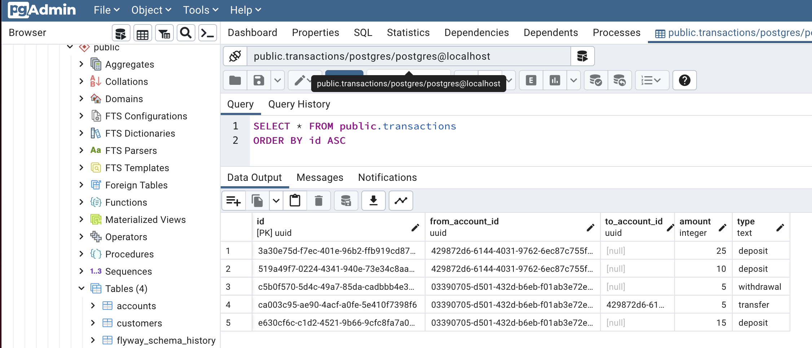

# Reactive Database Access Kotlin
This repository demonstrates how one could combine great libraries, tools and Kotlin 
language features like context receivers to work with databases in a convenient and reactive way. 
The tools include:
* [Kotlin](https://kotlinlang.org/) with [Gradle](https://kotlinlang.org/docs/gradle.html)
* [Spring Boot Framework](https://spring.io/projects/spring-boot)
* Reactive database access with [R2DBC ](https://r2dbc.io/)
* Typesafe SQL via [JOOQ](https://www.jooq.org/)
* Database Migrations using [Flyway](https://flywaydb.org/)
* [Postgres](https://www.postgresql.org/) database

### Dependency remarks
Some libraries that are used are currently unreleased 
snapshot versions. They will be updated to proper releases as soon as they are published.

### Requirements
* Java 17 (install via the [SDK Man](https://sdkman.io/)
* Docker with [Docker Compose](https://docs.docker.com/compose/)

## Kotlin database access
This project combines some language and library features
that provide an accessible and reactive way of working with
databases using Kotlin. Just look around the source code. 
Maybe you find something useful to adopt for yourself.

### Context receivers
Context receivers are a new Kotlin feature that enable an
elegant way of passing and using a `context` in form of
an implicit parameter when calling a function.

Functions can declare a dependency using the `context` construct
as part of the signature. This `context` can be used inside the function.
```kotlin
context(DSLContext) 
suspend fun plus(accountId: Account.Id, amount: Int): Account {
    return update(ACCOUNTS).set(ACCOUNTS.BALANCE, ACCOUNTS.BALANCE.plus(amount))
    // ...
}
```
In this example JOOQs `DSLContext` is declared as the `context`
to be available when calling the function. This allows the function
to access all exposed functions and properties of `DSLContext` like `update(...)`.
It requires the caller to provide an instance of it when calling the method `plus`:
```kotlin
val dslContext = //...
with(dslContext) {
    plus(myAccountId, 10)
} 
```
This feature can be used when passing a `context` between 
methods is required or helpful like a [transactional context
as used by JOOQ](https://www.jooq.org/doc/latest/manual/sql-execution/transaction-management/) for example. 
```kotlin
// ...
with(transactionalDslContext) {
    accountRepository.plus(transfer.fromAccountId, -transfer.amount)
    accountRepository.plus(transfer.toAccountId, transfer.amount)
    transactionRepository.save(transfer)
}
```
All function calls to the `accountRepository` and the `transactionRepositry`
are using the same `transactionalDslContext` as their `context`
passed via the `with()` construct.

### Inline classes 
The ability to encapsule value objects without runtime
overhead in proper types is possible in Kotlin using 
[inline classes](https://kotlinlang.org/docs/inline-classes.html).
This allows us to model scalar values like UUIDs references for 
foreign key relationships: 
```kotlin
data class Customer(val id: Id, val name:String) {
    @JvmInline
    value class Id(val value: UUID)
}
```
A `Customer.Id` is now a proper type and can only be used in
places where a `Customer.Id` is expected. This would not be possible
if we just used plain `UUID` as its type.
```kotlin
data class Account(
    //...
    val customerId: Customer.Id,
    // ...
)
```

The only disadvantage is that you have to wrap and unwrap the
value when you need to access it or create an instance of it:
```kotlin
insertInto(ACCOUNTS)
    .set(ACCOUNTS.ID, account.id.value)
    .set(ACCOUNTS.NAME, account.name)
    .set(ACCOUNTS.CUSTOMER_ID, account.customerId.value)
```

### Coroutines
Without diving too deep into the Kotlin way of [structured concurrency](https://kotlinlang.org/docs/coroutines-basics.html)
using coroutines, here is a simple example that using Reactor extensions
allow to leverage JOOQs reactive database support in a readable way:
```kotlin
suspend fun deposit(accountId: Account.Id, amount: Int) {
    assert(amount > 0)
    transactional {
        val deposit = Transaction.Deposit(
            id = Transaction.Id(UUID.randomUUID()),
            accountId = accountId,
            amount = amount
        )
        accountRepository.plus(deposit.accountId, deposit.amount)
        transactionRepository.save(deposit)
    }
}
```
using a simple, coroutine based helper method:
```kotlin
suspend fun <T> transactional(context: CoroutineContext = EmptyCoroutineContext, block: suspend DSLContext.() -> T): T {
    return dslContext.transactionPublisher { tx ->
        mono {
            block(tx.dsl())
        }
    }.awaitLast()
}
```
This is just a simple example that only covers the use-cases
of this demo setup but shows that a readable and reactive database access 
is possible.

### Sealed interfaces
Sealed interfaces allow to model closed hierarchies in a convenient 
way especially when one wants to use sealed error types. In this case
sealed interfaces allow a `Error.Transaction` error to be re-used in the `Error.Withdrawal` and `Error.Transfer`
 hierarchies. Meaning that for example an `Error.Transaction.CreditLineExceeded` error needs to be handled when dealing with a `Error.Withdrawal` error result.
```kotlin

sealed interface Error {
    sealed interface Withdrawal: Error
    sealed interface Transfer: Error
    sealed interface Transaction: Withdrawal, Transfer {
        data class CreditLineExceeded(val balanceValue: Int): Transaction
    }
}
```

If you want to dive deeper into this topic please take a look at
this inspiring [blog post](https://jorgecastillo.dev/sealed-interfaces-kotlin) by Jorge Catillo

### Arrow with Either
The [Arrow](https://arrow-kt.io/) library provides a lot of features that 
support functional programming in Kotlin. One example of this is
the [`Either`](https://arrow-kt.io/docs/apidocs/arrow-core/arrow.core/-either/) result type that can be used in combination with coroutines
and sealed classes based error hierarchies to provide a
programming model without requiring clients to handle exceptions:
```kotlin
private suspend fun saveCustomer(customer: Customer): Either<Error.CreateCustomer, Customer> = catch {
    customerRepository.save(customer)
}.mapLeft { e ->
    when {
        e.isConstraintxception("customers_name_key") -> Error.CreateCustomer.CustomerNameAlreadyExists(customer.name)
        else -> Error.Database(e)
    }
}
```

## Run
Make sure that the database is up and running by starting it via:
```shell
docker-compose up
```

Run the demo
```shell
./gradlew bootRun
```

or run the tests
```shell
./gradlew test
```

Use pgadmin to look at the database schema and data at: http://localhost:5050. Use `postgres` for the host to connect to.

